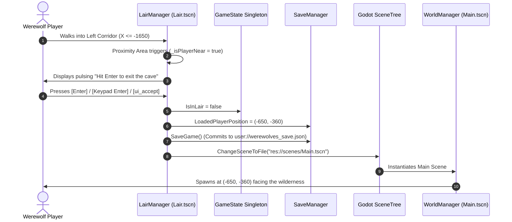

# Werewolf's Lair (Cave Hideout) — Technical Specification & Architecture

This document provides a comprehensive technical reference for the **Werewolf's Lair** (Cave Hideout) sub-system in *Werewolves*. It details the thematic design, spatial coordinates, scene architecture, procedural tile generation, collision bounds, transition mechanics, and safe-haven regeneration formulas.

---

## 1. Overview & Gameplay Role

The **Werewolf's Lair** serves as the protagonist's subterranean sanctuary and hideout amidst the hostile wilderness. It operates as an independent packed scene (`scenes/Lair.tscn`) separated from the open-world map.

### Key Objectives & Rules
1. **Safe Haven Sanctuary**: Inside the lair, aggressive wildlife and human villagers cannot enter. It acts as a secure refuge where the player can manage resources and interact with ancient subterranean structures.
2. **Manual Restoration via Blood Core**: Unlike passive healing, survival recovery inside the cave is strictly manual. Health and power are recovered through the central **Blood Core Altar** ('Press E'), eating Meat, drinking Blood Flasks, or using the Execute Bite skill.
3. **Compact "One-Screen" Scale**: Rather than a sprawling dungeon, the lair is tailored to a single-screen hideout scale (~1920×1080 viewport) with camera boundaries clamped strictly around the chamber and entrance tunnel.
4. **Pristine Interior**: The cavern interior contains zero wilderness debris (no choppable trees, mineral nodes, or loot drops) to ensure uncluttered movement and safety.
5. **Cosmic Cavern Aesthetic**: Surrounded by an ink-black void (`#030305`) illuminated by a procedurally twinkling starfield and drifting ethereal cavern mists.

---

## 2. Spatial Mapping & Coordinates

The game uses two coordinate systems:
1. **Godot World Coordinates (2D)**: Standard engine space where `+X` is East (Right) and `+Y` is South (Down).
2. **Map Coordinates**: Cartesian standard where `+X` is East and `+Y` is North (Up), calculated via:
   $$\text{MapPos} = (X, -Y)$$

### 2.1 Outside World Coordinates (Wilderness Landmark)

| Landmark / Point | Godot World Coordinates $(X, Y)$ | Map Coordinates $(X, Y)$ | Description |
| :--- | :--- | :--- | :--- |
| **Lair Entrance Landmark** | `(-650, -450)` | `(-650, 450)` | North-West of Awakening Grove `(0, 0)`. |
| **Wilderness Exclusion Buffer** | `Radius = 300 units` | `Radius = 300 units` | Strict exclusion zone clearing trees, rocks, quartz, and deer. |
| **Rare Chest Buffer** | `Radius = 700 units` | `Radius = 700 units` | Configured via `config/chests.json` (`lairBuffer`). |
| **Region Trigger Radius** | `Radius <= 450 units` | `Radius <= 450 units` | HUD region label reports `"Werewolf's Lair"`. |
| **Wilderness Return Position** | `(-650, -360)` | `(-650, 360)` | Position where the player reappears upon exiting the cave (`LairEntrancePosition + (0, 90)`). |

### 2.2 Inside Cave Interior Coordinates (`scenes/Lair.tscn`)

The interior coordinates are centered around the heart of the main chamber at `(0, 0)`:

| Point / Area | Local World Position $(X, Y)$ | Bounds / Dimensions | Notes |
| :--- | :--- | :--- | :--- |
| **Blood Core Altar** | `(0, 0)` | Scale: $0.38$, Pedestal radius $45\text{ px}$ | Ancient blood reservoir altar. 1000 default reserves. Manual restoration ([E]) and flask refilling ([R]). |
| **Crafting Table** | `(-700, -520)` | Scale: $0.35$, Footprint: $130 \times 40\text{ px}$ | Fixed position: Top Left. Opens Cave Crafting Menu on interaction. |
| **Blood Juicer** | `(0, -520)` | Scale: $0.35$, Footprint: $110 \times 40\text{ px}$ | Fixed position: Top Center. Life essence distillation apparatus. |
| **Alchemical Laboratory** | `(700, -520)` | Scale: $0.35$, Footprint: $130 \times 40\text{ px}$ | Fixed position: Top Right. Alembic research and potion synthesis installation. |
| **Storage Chests** | Dynamic: $X \in [-1000, 1000]$, $Y \in [-620, 620]$ | Scale: $0.30$, Footprint: $50 \times 26\text{ px}$ | Freeform placement with relocation capability. Closed/opened dual sprites and item storage modal. |
| **Player Spawn Point** | `(-1650, 0)` | Single Point | Placed at the left entrance tunnel facing right (`FlipH = false`). |
| **Camera Clamping Rect** | `(-1975, -950)` to `(1275, 950)` | Width: $3250$, Height: $1900$ | Configured via `Player.SetCameraLimits(-1975, -950, 1275, 950)`. |
| **Main Chamber Center** | `(0, 0)` | Spans $X \in [-1050, 1050]$, $Y \in [-700, 700]$ | $7 \times 5$ tile core room. |
| **Left Entrance Tunnel** | `(-1575, 0)` | Spans $X \in [-1750, -1050]$, $Y \in [-175, 175]$ | $2 \times 1$ tile corridor connecting to the exit arch. |
| **Exit Trigger Zone** | `(-1800, 0)` | Collision: $160 \times 300\text{ px}$ | Proximity check radius: $220\text{ px}$. |
| **Exit Arch Visual** | `(-1860, 0)` | Scale: $0.58$, Rotation: $0^\circ$ | Horizontally oriented stone archway. |

---

## 3. Outside Entrance Landmark (`LairEntranceObject.cs`)

The outside portal is managed by [`LairEntranceObject`](file:///run/media/devilbd/d/Development/godot-dev/werewolves-godot/Scripts/Entities/LairEntranceObject.cs) (`StaticBody2D`), dynamically instantiated by [`WorldManager.cs`](file:///run/media/devilbd/d/Development/godot-dev/werewolves-godot/Scripts/World/WorldManager.cs) at `(-650, -450)`.

```
                    [Blinking Prompt Label]
                 "Hit Enter to enter the cave"
                              ▲
                              │ (-265px offset)
                     ┌─────────────────┐
                     │   Stone Arch    │ (lair_entrance.png)
                     │     Sprite      │ (Scale: 0.75, Offset: -120px)
                     └────────┬────────┘
                              │
                    ┌─────────┴─────────┐
                    │ Collision Box     │ (380px × 90px solid stone base)
                    └─────────┬─────────┘
                              │
                    ( Proximity Area2D )  (Radius: 190px + 210px distance check)
```

### Technical Specifications
- **Visual Texture**: [`res://assets/lair/lair_entrance.png`](file:///run/media/devilbd/d/Development/godot-dev/werewolves-godot/assets/lair/lair_entrance.png) (Scale: `0.75×0.75`, vertical offset: `-120px`).
- **Physical Collision**: `RectangleShape2D` ($380\text{ px} \times 90\text{ px}$) positioned at `(0, -70)` to prevent the werewolf from walking through the boulder foundation.
- **Proximity Detection**: Dual validation combining `Area2D` body monitoring (`Radius = 190px`) with Euclidean distance checks (`DistanceSquaredTo(PlayerPosition) <= 210^2`).
- **IFogBorderable Implementation**: Integrates with the game's atmospheric dashed border rendering system:
  - `FogBounds = Rect2(-170, -175, 340, 180)`
  - `FogBorderColor = Color(0.78, 0.68, 1.0, 0.95)` (Mystic cavern violet).
- **Interactive Prompt**:
  - Warm golden label (`#fff073`) with black outline and drop shadow.
  - Smooth sinusoidal blinking between $\alpha = 0.20$ and $\alpha = 1.0$ at $5.0\text{ rad/s}$:
    $$\alpha(t) = 0.20 + 0.80 \cdot \left(0.5 + 0.5 \cdot \sin(5.0 \cdot t)\right)$$
- **Input Trigger**: Pressing <kbd>Enter</kbd>, <kbd>Numpad Enter</kbd>, or the `ui_accept` action initiates cave entry.
- **State Persistence on Entry**:
  1. Computes safe wilderness return position: $\vec{P}_{\text{return}} = \vec{P}_{\text{entrance}} + (0, 90) = (-650, -360)$.
  2. Stores $\vec{P}_{\text{return}}$ into [`SaveManager.LoadedPlayerPosition`](file:///run/media/devilbd/d/Development/godot-dev/werewolves-godot/Scripts/Core/SaveManager.cs) and [`GameState.Instance.PlayerPosition`](file:///run/media/devilbd/d/Development/godot-dev/werewolves-godot/Scripts/Core/GameState.cs).
  3. Writes save state to disk via `SaveManager.SaveGame()`.
  4. Changes active scene: `GetTree().ChangeSceneToFile("res://scenes/Lair.tscn")`.

---

## 4. Inside Cavern Layout & Schema (`LairManager.cs`)

The interior is procedurally constructed by [`LairManager.cs`](file:///run/media/devilbd/d/Development/godot-dev/werewolves-godot/Scripts/World/LairManager.cs) in `scenes/Lair.tscn`.

### 4.1 Floor Tile Grid Schema

The floor consists of 350×350 unit tiles mapped from 5 distinct textures in [`assets/lair/lair-floor/`](file:///run/media/devilbd/d/Development/godot-dev/werewolves-godot/assets/lair/lair-floor/) (`lair_1.jpeg` through `lair_5.jpeg`).

The grid is defined as a $5 \times 9$ matrix where numbers `1`–`5` specify the texture variant, and `0` denotes empty void space:

```text
                  Col 0    Col 1    Col 2    Col 3    Col 4    Col 5    Col 6    Col 7    Col 8
                  -1750    -1400    -1050     -700     -350        0      350      700     1050
               ┌────────┬────────┬────────┬────────┬────────┬────────┬────────┬────────┬────────┐
Row 0 (-700)   │   0    │   0    │  [2]   │  [3]   │  [4]   │  [5]   │  [4]   │  [3]   │  [2]   │
               ├────────┼────────┼────────┼────────┼────────┼────────┼────────┼────────┼────────┤
Row 1 (-350)   │   0    │   0    │  [1]   │  [1]   │  [1]   │  [1]   │  [1]   │  [1]   │  [1]   │
               ├────────┼────────┼────────┼────────┼────────┼────────┼────────┼────────┼────────┤
Row 2 (0)      │  [1]   │  [1]   │  [1]   │  [2]   │  [3]   │  [4]   │  [5]   │  [4]   │  [2]   │  ◄ Corridor + Chamber
               ├────────┼────────┼────────┼────────┼────────┼────────┼────────┼────────┼────────┤
Row 3 (350)    │   0    │   0    │  [1]   │  [1]   │  [1]   │  [1]   │  [1]   │  [1]   │  [1]   │
               ├────────┼────────┼────────┼────────┼────────┼────────┼────────┼────────┼────────┤
Row 4 (700)    │   0    │   0    │  [2]   │  [3]   │  [4]   │  [5]   │  [4]   │  [3]   │  [2]   │
               └────────┴────────┴────────┴────────┴────────┴────────┴────────┴────────┴────────┘
```

#### Texture Roles
- **`lair_1` (Pathway & Baseline)**: Smooth gray stone used for the entrance corridor (Cols 0–1, Row 2) and cross-corridors across Rows 1 & 3.
- **`lair_2` (Outer Stratum)**: Textured stone tiles flanking the chamber perimeter.
- **`lair_3` & `lair_4` (Transition Layers)**: Deep mineral gradations transitioning inward.
- **`lair_5` (Heart of the Lair)**: Central focal stone forming the inner sanctum of the hideout (Col 5 on Rows 0, 2, 4).

#### Tile Sizing & Downscaling
- **Native Texture Size**: $2048 \times 2048\text{ px}$.
- **Target In-Game Size**: $350 \times 350\text{ units}$ (matching wilderness ground interval).
- **Scale Factor**:
  $$\text{TileScale} = \frac{350}{2048} \approx 0.1708984$$

### 4.2 Procedural Terrain Borders (`BuildTerrainBorders`)

To eliminate harsh square tile cutoffs, [`lair_border_o.png`](file:///run/media/devilbd/d/Development/godot-dev/werewolves-godot/assets/lair/lair_border_o.png) is programmatically placed along every exposed perimeter edge:
- **Top Edge**: Placed at $(X_c, Y_r - 175\text{px})$, `RotationDegrees = 0°`.
- **Right Edge**: Placed at $(X_c + 175\text{px}, Y_r)$, `RotationDegrees = 90°`.
- **Bottom Edge**: Placed at $(X_c, Y_r + 175\text{px})$, `RotationDegrees = 180°`.
- **Left Edge**: Placed at $(X_c - 175\text{px}, Y_r)$, `RotationDegrees = -90°`.
- **Layering**: Assigned `ZIndex = -5` to sit above floor tiles (`ZIndex = -10`) and beneath entities (`ZIndex = 0`).

---

## 5. Collision Architecture & Boundaries

The boundaries are enforced by a dedicated `StaticBody2D` named `"Boundaries"`:

```text
               [-1925, -185] ────── Top Wall (720×40) ────── [-1225, -185] ──┐
                     │                                                       │
                     │                                           Upper Left Wall (60×720)
                     │                                           [-1235, -525]
                     │                                                       │
     Back End Wall   │                                                       ▼
      [-1925, 0]     │   Entrance Corridor              Main Chamber Top Wall (2500×60) [0, -885]
       (40×380)      │   [Player Spawn: (-1650, 0)]    ┌──────────────────────────────────────────────┐
                     │                                 │                                              │
                     │   Left Exit Area: (-1800, 0)    │               Cavern Center                  │ Solid Single
                     │   Exit Arch:      (-1860, 0)    │                   (0, 0)                     │ Right Wall
                     │                                 │                                              │ [1235, 0]
                     │                                 │                                              │ (60×1800)
                     │                                 │                                              │
               [-1925, 185] ───── Bottom Wall (720×40) ───── [-1225, 185] ──┘                                │
                                                       │                                              │
                                           Lower Left Wall (60×720)                                   │
                                           [-1235, 525]                                               │
                                                       │                                              │
                                                       ▼                                              │
                                                Main Chamber Bottom Wall (2500×60) [0, 885]           │
                                               └──────────────────────────────────────────────┘
```

### Boundary Segment Details
1. **Top Chamber Wall**: Size $2500 \times 60$, centered at `(0, -885)`.
2. **Bottom Chamber Wall**: Size $2500 \times 60$, centered at `(0, 885)`.
3. **Right Chamber Wall**: Solid single wall with **no exit or opening**, size $60 \times 1800$, centered at `(1235, 0)`.
4. **Upper Left Chamber Wall**: Size $60 \times 720$, centered at `(-1235, -525)`.
5. **Lower Left Chamber Wall**: Size $60 \times 720$, centered at `(-1235, 525)`.
6. **Corridor Top Wall**: Size $720 \times 40$, centered at `(-1575, -185)`.
7. **Corridor Bottom Wall**: Size $720 \times 40$, centered at `(-1575, 185)`.
8. **Corridor End Cap**: Size $40 \times 380$, centered at `(-1925, 0)` backing the left exit arch.

---

## 6. Atmosphere, Lighting & Environment

### 6.1 Cosmic Void & Procedural Starfield
- **Background ColorRect**: Fills `(-3600, -2400)` to `(3600, 2400)` with pitch black `#030305` (`ZIndex = -50`).
- **Default Engine Clear Color**: Adjusted via `RenderingServer.SetDefaultClearColor(Color(0.010, 0.012, 0.018))` on ready, restored to `#1f1f1f` on scene exit.
- **Twinkling Starfield (`LairStarfield`)**:
  - Procedural node rendering **240 stars** across a $4200 \times 2800$ canvas.
  - Each star possesses randomized coordinates, radius ($0.75$–$2.2\text{ px}$), base brightness ($0.25$–$0.95$), sinusoidal oscillation phase ($\phi \in [0, 2\pi]$), and period ($1.5$–$4.5\text{ seconds}$).
  - Rendered via trigonometric `_Draw()` batch updates.

### 6.2 Cavern Fog Zones
- **Chamber Fog**: Centered at `(0, 0)`, radius $950\text{ units}$, density $0.25$, soft blue mist `Color(0.72, 0.82, 0.95, 0.22)`, cycle speed $0.025$.
- **Corridor Fog**: Centered at `(-1350, 0)`, radius $520\text{ units}$, density $0.20$, cycle speed $0.03$.
- **Layering**: `ZIndex = 5`, causing the mist to drift gracefully over the floor tiles and the feet of the werewolf.

---

## 7. Exit System & Return Flow

Exiting the cave mirrors entering it, utilizing the left entrance arch:



### Exit Safeguards
- **Re-trigger Prevention**: Returning to the wilderness places the player at $Y = -360$, which is $90\text{ units}$ south of the outside entrance hitbox ($Y = -450$). This prevents the player from immediately triggering the entrance again upon load.
- **Cursor Reset**: Explicitly restores `res://assets/cursors/normal_o.png` on scene unload to guarantee no stuck interaction cursors.

---

## 8. Blood Core & Manual Cave Recovery Mechanics

Automatic safe-haven regeneration inside the cave is disabled. While inside the lair, passive health and power regeneration over time do not run. Instead, health and power can only be recovered through active gameplay interactions:

1. **Blood Core Altar ('Press E')**:
   - Location: Center of the cavern chamber at `(0, 0)`.
   - Default Reserves: **1000 Blood** (persisted in `SaveManager`).
   - Cost: **250 Blood** per activation.
   - Benefit: Restores up to **12 Health** and **13 Power** (25 total points).
   - Display: Percentage progress bar above the sprite showing `"{percent}% ({reserves} / {max})"`.
2. **Filling the Blood Core ('Press R')**:
   - Approach the Blood Core with blood flasks in your pouch.
   - Press <kbd>R</kbd> to pour blood from a flask into the core ($100\%$ flask adds $+250\text{ blood}$, proportional to fill).
   - The emptied flask is returned to the pouch as an stackable `"EmptyFlask"`.
3. **Eating Meat**:
   - Right-click `"Meat"` in the pouch modal to eat. Restores **+20 HP** and **+10 Power**, consuming 1 piece of meat.
4. **Drinking Blood Flasks**:
   - Right-click a `"BloodFlask"` in the pouch modal to drink. Restores Health up to **+25 HP** and Power up to **+2 Power** (heavily reduced power gain, scaled by fill percentage), converting the flask to a reusable `"EmptyFlask"`.
5. **Drinking Power Flasks**:
   - Right-click a `"PowerFlask"` in the pouch modal to drink. Restores Power up to **+25 Power** (scaled by fill percentage), converting the flask to a reusable `"EmptyFlask"`.
6. **Execute Bite (Skill 3)**:
   - When executed against a low-health target ($\le 25\%$ HP), restores $+20\text{ HP}$.

---

## 9. Cavern Workshop, Crafting Menu & Storage Chests

The lair features an integrated crafting and installation system enabling the werewolf to customize and expand their subterranean sanctuary:

```
                         [Blood Juicer]
                         (Top Center: 0, -520)
                               ▲
   [Crafting Table]            │            [Laboratory]
 (Top Left: -700, -520) ◄──────┼──────► (Top Right: 700, -520)
                               │
                       [Blood Core Altar]
                            (0, 0)
                               │
               [Freeform Placed Storage Chests]
                     (X: ±1000, Y: ±620)
```

### 9.1 Crafting Recipes & Workshop Installations

| Installation | World Position | Recipe Costs | Purpose / Mechanics |
| :--- | :--- | :--- | :--- |
| **Storage Chest** | Freeform in Cavern | $10\text{ Logs} + 5\text{ Stones}$ | Placed via interactive ghost mode; stores pouch items with bi-directional transfer. Relocatable at any time. |
| **Crafting Table** | Top Left: `(-700, -520)` | $25\text{ Logs} + 15\text{ Stones}$ | Unique installation. Left-clicking or interacting opens the Cave Crafting Menu. |
| **Blood Juicer** | Top Center: `(0, -520)` | $30\text{ Stones} + 20\text{ Quartz} + 100\text{ Blood}$ | Unique installation. Refines raw vitae and organic essence (costs 100 blood from core). |
| **Alchemical Laboratory** | Top Right: `(700, -520)` | $25\text{ Stones} + 25\text{ Quartz} + 15\text{ Grass}$ | Unique installation. Advanced distillation and potion synthesis apparatus. |

### 9.2 Storage Chest Mechanics & Dynamic Relocation
1. **Interactive Placement Mode**:
   - Committing to craft a Storage Chest initiates placement mode.
   - A ghost preview of `chest_closed.png` follows the mouse cursor with real-time chamber clearance checking ($X \in [-1000, 1000]$, $Y \in [-620, 620]$, clearance $\ge 120\text{px}$ from Blood Core, static structures, and other chests).
   - Tinted green when placement is valid; red when obstructed.
   - Left-click confirms and constructs the chest; Right-click or <kbd>Esc</kbd> cancels without consuming materials.
2. **Relocation Mechanics**:
   - Any placed chest can be moved at any time by opening its inventory and clicking **"Move Chest"**.
   - Temporarily removes the chest into placement mode to reposition it without any resource cost.
3. **Dual Visual States**:
   - World sprite displays [`chest_closed.png`](assets/chests/chest_closed.png) while closed.
   - Transitions to [`chest_opened.png`](assets/chests/chest_opened.png) while its inventory modal is active.
4. **Storage Inventory Interface**:
   - $600 \times 450\text{px}$ modal styled with [`chest_inventory.png`](assets/chests/chest_inventory.png).
   - Freeform draggable canvas ($530 \times 365\text{px}$) matching the Pouch interface (no grid slots).
   - Custom item coordinates persist per-chest in `CaveChestData.Items`.
   - Click transfers 1 item to the pouch; <kbd>Shift</kbd> + Click opens the `ItemSplitModal` to select exact quantities.
   - Automatically displays the PouchWindow alongside the chest modal for seamless item management.

### 9.3 Workshop Station Recipes & Tabs
The Cave Crafting Menu ([`CraftingWindow.cs`](file:///run/media/devilbd/d/Development/godot-dev/werewolves-godot/Scripts/UI/CraftingWindow.cs)) provides station filter tabs for streamlined recipe management:
- **`[All Recipes]`**: Complete list of craftable installations and consumable items.
- **`[Crafting Table]`**: Displays items craftable at the Crafting Table:
  - **Empty Flask**: Costs $2\text{ Quartz} \implies 1\text{ EmptyFlask}$.
  - **Power Flask**: Costs $1\text{ EmptyFlask} + 2\text{ Grass} + 1\text{ Quartz} \implies 1\text{ PowerFlask (100\% Power)}$.
- **`[Laboratory]`**: Displays alchemical recipes:
  - **Power Flask**: Synthesizes $1\text{ EmptyFlask} + 2\text{ Grass} + 1\text{ Quartz} \implies 1\text{ PowerFlask (100\% Power)}$.
- **`[Cavern Installations]`**: Filters to large workshop structures and storage chests.

Interacting with the physical Crafting Table (`-700, -520`) or Alchemical Laboratory (`700, -520`) automatically opens the Crafting Window filtered to that respective station's recipe list.

### 9.4 Blood Juicer Distillation Mechanics
Interacting with the **Blood Juicer** (`0, -520`) opens the dedicated **Blood Juicer Window** ([`BloodJuicerWindow.cs`](file:///run/media/devilbd/d/Development/godot-dev/werewolves-godot/Scripts/UI/BloodJuicerWindow.cs), $560 \times 420\text{px}$):
1. **Meat Chamber**: Holds placed raw meat inside the juicer apparatus. Players can deposit meat from pouch (`+1` or `+All`), right-click meat in the pouch while juicer is open, or take meat back (`Take`). Placed meat count persists across saves in `SaveManager`.
2. **Juicing Action & Exchange Rate**:
   - Compresses $1\text{ Meat} \implies +50\%\text{ Blood}$ fill.
   - Requires at least one `"EmptyFlask"` or a partially filled `"BloodFlask"` in the pouch.
   - Automatically promotes an Empty Flask to a $50\%$ Blood Flask, or tops off an existing partial Blood Flask to $100\%$.
   - Features **"Extract Blood (1 Meat)"** and **"Extract All Meats"** batch processing buttons.

### 9.5 In-Game Object Dismantling & Resource Recovery
Both storage chests and fixed workshop installations can be dismantled at will:
1. **Storage Chest Dismantling**:
   - Access: Inside the chest inventory modal (`ChestInventoryWindow`), click the red **`[ Dismantle ]`** button.
   - Item Safety: Before the chest is removed, all stored items are automatically moved back into the player's pouch.
   - Material Refund: Returns $100\%$ of construction materials ($10\text{ Logs}$, $5\text{ Stones}$) to the pouch.
   - Cleanup: Removes the chest from `GameState.CaveChests`, despawns the world node, resets the mouse cursor, and triggers an auto-save.
2. **Workshop Station Dismantling**:
   - Access: In `CraftingWindow`, built structures (`CraftingTable`, `BloodJuicer`, `Laboratory`) dynamically display a crimson **`[ Dismantle ]`** button instead of "Craft".
   - 100% Resource Refund: Returns all raw recipe ingredients ($100\%$) directly to the pouch.
   - Blood Refund: Returns any BloodCost (e.g. $100\text{ blood}$ from the Blood Juicer) back to the central Blood Core altar.
   - Meat Evacuation: If dismantling the Blood Juicer, any raw meat remaining in the juicer chamber is returned to the pouch.
   - World Despawn: Fires `OnStaticObjectDismantled` to despawn the node in `LairManager`.
3. **Automated Save Migration & Resource Restoration (`SaveManager.cs`)**:
   - Save files are versioned (`SaveVersion = 3`).
   - Prior to migrating older save states, an automated timestamped backup is generated (`user://werewolves_save.backup_v{version}_{timestamp}.json`).
   - When game version updates destroy or wipe placed cavern installations, the migration engine automatically detects missing structures and restores $100\%$ of their raw ingredients into the player's pouch and Blood Core altar.

---

## 10. UI & HUD Integration

The lair scene includes a dedicated [`HUDManager`](file:///run/media/devilbd/d/Development/godot-dev/werewolves-godot/Scripts/UI/HUDManager.cs) instance supporting all gameplay overlays:
1. **Position / Region Banner**:
   - Condition: `GameState.Instance.IsInLair == true`
   - Formatted Text: `$"Werewolf's Lair | Hideout ({(int)pos.X}, {(int)pos.Y})"`
2. **Health & Power Orbs**: Real-time liquid simulation reflecting manual restoration and skill usage.
3. **Skills & Action Menus**:
   - [`StatsPanel`](file:///run/media/devilbd/d/Development/godot-dev/werewolves-godot/scenes/UI/StatsPanel.tscn) (Skill hotkeys 1–4).
   - [`ActionBar`](file:///run/media/devilbd/d/Development/godot-dev/werewolves-godot/scenes/UI/ActionBar.tscn) (Hero Details <kbd>C</kbd>, Inventory Pouch <kbd>P</kbd>, Cave Crafting <kbd>B</kbd>, and Cavern Map <kbd>M</kbd>).
4. **Draggable Modals**:
   - [`PouchWindow`](file:///run/media/devilbd/d/Development/godot-dev/werewolves-godot/scenes/UI/PouchWindow.tscn) for inventory inspection, dragging, right-click consumption, and chest depositing.
   - [`HeroDetailsWindow`](file:///run/media/devilbd/d/Development/godot-dev/werewolves-godot/scenes/UI/HeroDetailsWindow.tscn) for viewing live combat attributes.
   - [`CraftingWindow`](file:///run/media/devilbd/d/Development/godot-dev/werewolves-godot/Scripts/UI/CraftingWindow.cs) for viewing recipes and constructing cave installations (<kbd>B</kbd>).
   - [`BloodJuicerWindow`](file:///run/media/devilbd/d/Development/godot-dev/werewolves-godot/Scripts/UI/BloodJuicerWindow.cs) for depositing meat and distilling blood into empty or partial flasks.
   - [`ChestInventoryWindow`](file:///run/media/devilbd/d/Development/godot-dev/werewolves-godot/Scripts/UI/ChestInventoryWindow.cs) for chest storage and item retrieval.
   - [`ItemSplitModal`](file:///run/media/devilbd/d/Development/godot-dev/werewolves-godot/Scripts/UI/ItemSplitModal.cs) for Shift-click stack quantity selection.
   - [`MapWindow`](file:///run/media/devilbd/d/Development/godot-dev/werewolves-godot/Scripts/UI/MapWindow.cs) for viewing the subterranean layout, Blood Core reserve %, workshop stations, and placed storage chests (<kbd>M</kbd>).

---

## 11. Summary File Map

| File Path | Role |
| :--- | :--- |
| [`scenes/Lair.tscn`](file:///run/media/devilbd/d/Development/godot-dev/werewolves-godot/scenes/Lair.tscn) | Dedicated packed scene containing the Lair environment, player, Blood Core, workshop structures, and HUD. |
| [`Scripts/World/LairManager.cs`](file:///run/media/devilbd/d/Development/godot-dev/werewolves-godot/Scripts/World/LairManager.cs) | Scene controller: manages floor schema generation, borders, collision, Blood Core attachment, chest placement mode, and exit logic. |
| [`Scripts/Entities/BloodCoreObject.cs`](file:///run/media/devilbd/d/Development/godot-dev/werewolves-godot/Scripts/Entities/BloodCoreObject.cs) | Blood Core altar entity: reserves tracking, percentage progress bar, 'Press E' restoration, 'Press R' flask refilling. |
| [`scenes/Entities/BloodCoreObject.tscn`](file:///run/media/devilbd/d/Development/godot-dev/werewolves-godot/scenes/Entities/BloodCoreObject.tscn) | Packed scene for the Blood Core altar. |
| [`Scripts/Entities/CaveChestObject.cs`](file:///run/media/devilbd/d/Development/godot-dev/werewolves-godot/Scripts/Entities/CaveChestObject.cs) | Cavern storage chest entity: closed/opened sprite toggling, proximity interaction, and selection reticle. |
| [`scenes/Entities/CaveChestObject.tscn`](file:///run/media/devilbd/d/Development/godot-dev/werewolves-godot/scenes/Entities/CaveChestObject.tscn) | Packed scene for cavern storage chests. |
| [`Scripts/Entities/CaveStaticObject.cs`](file:///run/media/devilbd/d/Development/godot-dev/werewolves-godot/Scripts/Entities/CaveStaticObject.cs) | Static workshop structures entity (Crafting Table, Blood Juicer, Laboratory) with collision and interaction hooks. |
| [`Scripts/UI/CraftingWindow.cs`](file:///run/media/devilbd/d/Development/godot-dev/werewolves-godot/Scripts/UI/CraftingWindow.cs) | Draggable crafting menu modal showing recipes, station tabs, material checks, and placement triggers (<kbd>B</kbd>). |
| [`Scripts/UI/BloodJuicerWindow.cs`](file:///run/media/devilbd/d/Development/godot-dev/werewolves-godot/Scripts/UI/BloodJuicerWindow.cs) | Draggable blood juicer modal with meat chamber, single/batch extraction, and live flask preview. |
| [`Scripts/UI/ChestInventoryWindow.cs`](file:///run/media/devilbd/d/Development/godot-dev/werewolves-godot/Scripts/UI/ChestInventoryWindow.cs) | Draggable freeform storage chest modal using `chest_inventory.png` background. |
| [`Scripts/UI/ItemSplitModal.cs`](file:///run/media/devilbd/d/Development/godot-dev/werewolves-godot/Scripts/UI/ItemSplitModal.cs) | Modal dialog for choosing stack split quantities with slider, steppers, and presets on Shift+click. |
| [`Scripts/UI/MapWindow.cs`](file:///run/media/devilbd/d/Development/godot-dev/werewolves-godot/Scripts/UI/MapWindow.cs) | Draggable world and cavern map modal supporting 1800m radar perception, pan/zoom, and hideout layout inspection (<kbd>M</kbd>). |
| [`assets/icons/map_icon.png`](file:///run/media/devilbd/d/Development/godot-dev/werewolves-godot/assets/icons/map_icon.png) | Antique brass compass rose icon texture for ActionBar Slot 4. |
| [`assets/flasks/power_flask_0..100.png`](file:///run/media/devilbd/d/Development/godot-dev/werewolves-godot/assets/flasks/) | 4-tier azure power flask sprites ($0\%, 25\%, 50\%, 100\%$). |
| [`Scripts/Core/CaveChestData.cs`](file:///run/media/devilbd/d/Development/godot-dev/werewolves-godot/Scripts/Core/CaveChestData.cs) | Serialized data model for placed chest positions and stored items. |
| [`Scripts/Core/CraftingRecipe.cs`](file:///run/media/devilbd/d/Development/godot-dev/werewolves-godot/Scripts/Core/CraftingRecipe.cs) | Domain model defining ingredients, station filters, and placement/item metadata for craftable objects. |
| [`Scripts/Entities/LairEntranceObject.cs`](file:///run/media/devilbd/d/Development/godot-dev/werewolves-godot/Scripts/Entities/LairEntranceObject.cs) | Outside world landmark: proximity detection, prompt animation, and scene transition. |
| [`Scripts/World/WorldManager.cs`](file:///run/media/devilbd/d/Development/godot-dev/werewolves-godot/Scripts/World/WorldManager.cs) | Outside landmark spawner, wilderness exclusion zones, and coordinate conversions. |
| [`assets/cave-objects/blood-core.png`](file:///run/media/devilbd/d/Development/godot-dev/werewolves-godot/assets/cave-objects/blood-core.png) | High-resolution sprite for the central Blood Core altar. |
| [`assets/cave-objects/crafting-table.png`](file:///run/media/devilbd/d/Development/godot-dev/werewolves-godot/assets/cave-objects/crafting-table.png) | Texture for the Crafting Table static structure. |
| [`assets/cave-objects/blood-juicer.png`](file:///run/media/devilbd/d/Development/godot-dev/werewolves-godot/assets/cave-objects/blood-juicer.png) | Texture for the Blood Juicer static structure. |
| [`assets/cave-objects/laboratory.png`](file:///run/media/devilbd/d/Development/godot-dev/werewolves-godot/assets/cave-objects/laboratory.png) | Texture for the Alchemical Laboratory static structure. |
| [`assets/chests/chest_closed.png`](file:///run/media/devilbd/d/Development/godot-dev/werewolves-godot/assets/chests/chest_closed.png) | Closed world sprite for storage chests. |
| [`assets/chests/chest_opened.png`](file:///run/media/devilbd/d/Development/godot-dev/werewolves-godot/assets/chests/chest_opened.png) | Open world sprite displayed while a chest modal is active. |
| [`assets/chests/chest_inventory.png`](file:///run/media/devilbd/d/Development/godot-dev/werewolves-godot/assets/chests/chest_inventory.png) | $600 \times 450\text{px}$ background frame for the chest inventory window. |
| [`assets/lair/lair_entrance.png`](file:///run/media/devilbd/d/Development/godot-dev/werewolves-godot/assets/lair/lair_entrance.png) | Entrance stone archway sprite used for outside landmark and inside exit portal. |
| [`assets/lair/lair_border_o.png`](file:///run/media/devilbd/d/Development/godot-dev/werewolves-godot/assets/lair/lair_border_o.png) | Rocky perimeter fringe texture for seamless terrain edging. |
| [`assets/lair/lair-floor/lair_1..5.jpeg`](file:///run/media/devilbd/d/Development/godot-dev/werewolves-godot/assets/lair/lair-floor/) | 5 stone tile textures arranged according to the $5 \times 9$ cavern floor matrix. |
